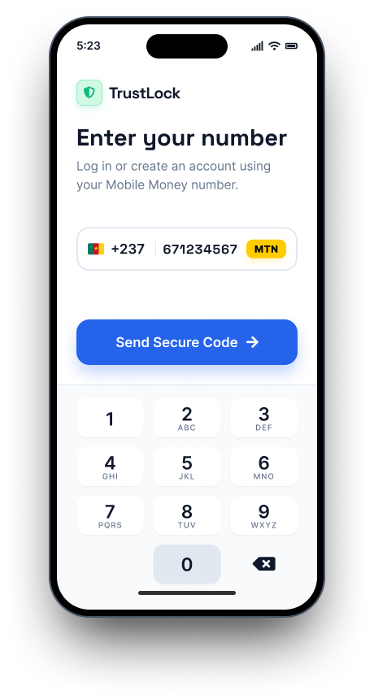
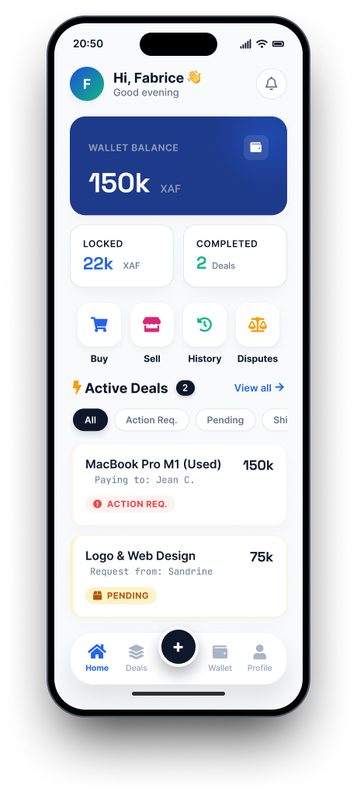
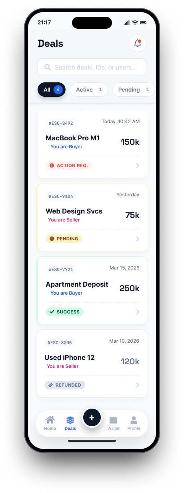
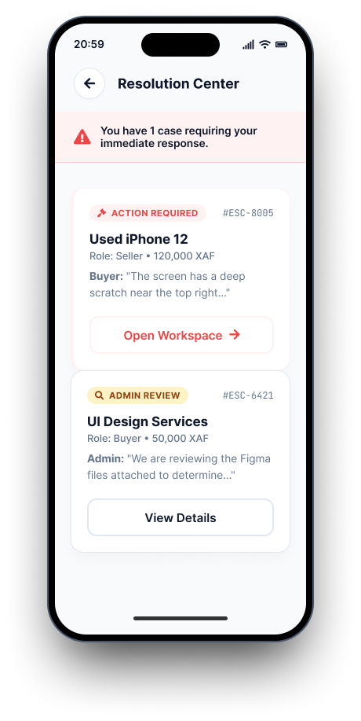

# TrustLock Mobile — Native iOS & Android App

<div align="left">
  
  
  
  
</div>

<br />

TrustLock Mobile is the native client for the TrustLock ecosystem — a digital escrow platform built for the Cameroonian market. It allows users to securely manage peer-to-peer transactions, lock funds using MTN MoMo and Orange Money, and resolve disputes with confidence.

This app communicates directly with the backend API provided by the TrustLock Web platform.

> **Backend (Web API):** *[https://github.com/Hyson-Wayne/trustlock-mobile]*

---

## Demo — How It Works

TrustLock is designed to make transactions between strangers safe and predictable.

1. **Create Escrow**  
   A buyer creates a transaction and defines the terms.

2. **Fund Transaction**  
   Funds are securely locked via MTN MoMo or Orange Money.

3. **Delivery Phase**  
   The seller delivers the product or service.

4. **Release or Dispute**  
   - Buyer confirms → funds are released  
   - Issue detected → dispute is raised and handled by admin

Everything follows a strict state flow to prevent fraud and ensure accountability.

---

## Key Features

- **Passwordless Authentication**  
  Secure OTP login using Supabase Auth with tokens stored via `expo-secure-store`.

- **Real-Time Dashboard**  
  Live updates for escrows, wallet balances, and pending actions.

- **Transaction Engine**  
  Clean flows for escrow creation, funding, delivery confirmation, and dispute handling.

- **Native Performance**  
  Smooth animations, swipe gestures, and responsive UI built with React Native.

- **Modern UI System**  
  Glassmorphism, floating action buttons (FAB), and bottom-sheet interactions.

---

## Screenshots

<!-- Replace these with your actual images -->

### 🔐 Authentication



### 📊 Dashboard



### 💸 Transaction Flow



### ⚖️ Dispute Handling



---

## System Relationship

TrustLock is a full ecosystem made of:

- **Web Platform (Next.js)** → Admin + API Gateway  
- **Mobile App (React Native)** → User-facing experience  

The mobile app does not access the database directly. All requests pass through the secure API layer.

---

## Local Development

### 1. Clone & Install

```bash
git clone https://github.com/Hyson-Wayne/trustlock-mobile.git
cd trustlock-mobile
npm install
````

### 2. Environment Setup

Create a `.env` file:

```env
# Supabase Auth
EXPO_PUBLIC_SUPABASE_URL="https://[PROJECT_REF].supabase.co"
EXPO_PUBLIC_SUPABASE_ANON_KEY="anon-key"

# Optional
EXPO_PUBLIC_APP_NAME="TrustLock"
```

### 3. Run the App

```bash
npx expo start
```

- Install **Expo Go**
- Scan the QR code
- Ensure your backend is running locally

---

## Security Notes

- Authentication handled via Supabase JWT tokens
- Tokens stored securely on-device using `expo-secure-store`
- All sensitive operations are executed through the backend API
- No direct database access from the mobile client

---

## License

Copyright © 2026 **Nditafon Hyson**. All rights reserved.

This project and its source code are the exclusive intellectual property of the author. No part of this repository may be reproduced, distributed, or transmitted in any form or by any means — including photocopying, recording, or other electronic or mechanical methods — without prior written permission.

For permission requests, please contact the author directly.

---

## Author & Contact

**Nditafon Hyson**
UI/UX Designer | DevOps Engineer | Software Developer

- [](mailto:nditafonhysonn@gmail.com)
- [](tel:+237679638540)
- [](mailto:nditafonhysonn@gmail.com)
- [](https://www.behance.net/nditafonhyson)
- [](https://github.com/Hyson-Wayne)
- [](https://www.linkedin.com/in/nditafon-hyson-762a6623b/)

```
